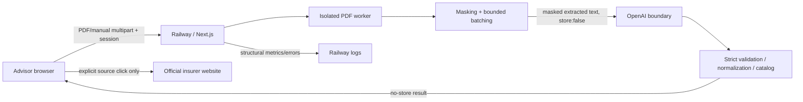

# NITO pre-pilot security, GDPR & product readiness audit

## EXECUTIVE SUMMARY

**Versjon:** `d3a37985fce4ada65fa2f7a88462d8834e4677af` (`main`, clean, identisk med `origin/main`). **Produksjon:** Railway ACTIVE / Deployment successful, app online, tracing OFF.

Fire rådgivere kan teknisk bruke appen samtidig fordi kundeanalyse og objektreferanser er request-lokale, det finnes ingen kundedatabase og concurrency-/isolasjonsregresjonene består. Dagens delte pilotkode gir likevel ingen individuell identitet, revokering eller hendelsesattribusjon. Løsningen er derfor egnet bare som en stramt kontrollert fire-rådgiverpilot med eksplisitte operasjonelle kontroller.

Skadeforsikringsdokumenter kan behandles først etter at obligatoriske før-pilot-tiltak er godkjent: edge-rate-limit, vendor/DPA/retention/region, personverninformasjon, hendelses-/sletteprosess, tilgangseiere og Safari-smoke. Den lokale dataflyten er forstått og hovedsakelig ephemeral; Railway/OpenAI-retention er ikke teknisk bevist. Ingen teknisk kundedatalekkasje ble funnet i testede baner. Personforsikring er **ikke klar**.

## VERSION / SCOPE

- Audit: read-only, 2026-09-29; ingen ekte kundedata, ingen repo-/Railway-endring.
- Commit: `d3a37985fce4ada65fa2f7a88462d8834e4677af` – Add source-backed boat and pet insurance pipelines.
- Node v24.21.0, npm 11.19.0.
- Faktisk katalog: 204 produkter, 84 tillegg, 202 produktmodus-eligible, 12 familier, 329 source artifacts.
- Verifikasjon: 1996/1996 tester, TypeScript, ESLint, webpack build, syntetisk HTTP/PDF-runtime og produktmodus-runtime PASS.

## OVERALL PILOT GATE

| Gate | Resultat |
|---|---|
| NITO_PILOT_GATE | **READY_WITH_ACTIONS** |
| SECURITY_GATE | **PASS_WITH_ACTIONS** |
| GDPR_READINESS | **READY_AFTER_DOCUMENTATION_ACTIONS** |
| PRODUCT_GATE | **PILOT_READY** |
| PERSON_INSURANCE_PRIVACY_GATE | **NOT_READY** |

**Vilkår:** Ikke start behandling av ekte kundedata før alle obligatoriske bokser i `pilot-manual-checklist.md` er godkjent av navngitte tekniske, organisatoriske og juridiske/personvernansvarlige.

## BLOCKERS

Ingen teknisk skadeforsikrings-blocker ble bevist i de testede banene. Personforsikring har egen blokkert gate. Manglende før-pilot-avklaringer er bindende actions, ikke påståtte juridiske konklusjoner.

## IMPORTANT FINDINGS

- **SEC-001 · AUTHENTICATION:** Reduced accountability and offboarding; residual unauthorized-access risk.
- **SEC-002 · AUTHENTICATION:** Credential guessing, service exhaustion or AI cost exposure.
- **SEC-003 · NETWORK:** Increased clickjacking/content-injection blast radius and metadata leakage.
- **SEC-004 · DATA_LIFECYCLE:** Unknown deletion/retention and data-subject response obligations.
- **SEC-005 · PRIVACY_DOCUMENTATION:** Uncontrolled organizational handling even if request processing is technically ephemeral.
- **SEC-006 · AI_BOUNDARY:** More personal data may reach a processor than the UI wording "relevant, maskert tekst" may suggest.
- **PROD-001 · pilot access / cross-customer:** Shared workstations can retain access and the prior result; advisors lack an explicit end-of-case action.
- **PROD-002 · onboarding/privacy:** Advisor cannot answer a customer or internal question about ownership, rights, retention or escalation from the product.
- **PROD-003 · pilot operations:** A capable advisor can understand the core UI, but safe independent handling of errors/incidents depends on developer knowledge.
- **PROD-004 · feedback/support:** Advisors cannot consistently distinguish ordinary feedback, correctness bugs and privacy/security incidents.
- **PROD-005 · browser compatibility:** Safari-specific upload, details/summary or streaming issues could surprise an advisor.
- **PROD-006 · result interpretation:** Advisor may overinterpret uncertainty as absence of cover.
- **PROD-007 · new customer / recovery:** End-of-case hygiene is less obvious and previous-customer state can remain visible.

## POLISH

- **SEC-007:** Low while off; operational drift can expand logging.
- **SEC-008:** Low standalone impact.
- **SEC-009:** Security posture can decay over time.
- **PROD-008:** Unbranded English fallback is less professional but does not block workflow.
- **PROD-009:** Minor uncertainty about access lifecycle and help route.

## THREAT MODEL

Assets: customer PDFs/facts/results, session, secrets, catalog/source data and configuration. Actors: authorized advisor, unauthorized internet user, another advisor, malicious document, compromised browser and accidental internal disclosure.

Trust boundaries are browser↔Railway, server↔worker, server↔OpenAI, runtime↔Railway logs/config and browser↔provider source site.

## DATA FLOW

**PDF:** Browser File → authenticated bounded POST → signature/size validation → memory/worker parsing → deterministic masking → OpenAI Responses API → strict runtime validation → normalization/catalog/matching → no-store browser result. Original PDF and original filename are not sent to OpenAI.

**Manual:** React state → authenticated POST → server normalization/catalog → comparison; manual-only has no AI call. **Hybrid:** only PDF side crosses AI boundary. **Product mode:** static catalog, local deterministic comparison, no AI/PDF/provider fetch. **Feedback:** no implementation found. **Auth:** shared code → signed 12-hour HttpOnly/Secure/SameSite cookie.

## DATA LIFECYCLE

`DATA LIFECYCLE RESULT = PARTIALLY_UNDERSTOOD`. Customer PDF, extracted text and facts are request-memory only on server; results/manual fields remain in React/DOM memory until input change, reload or tab close. No database, object store, customer temp-file write, public upload, localStorage, sessionStorage, analytics or export feature was found. OpenAI and Railway log/temp retention, region, backup and deletion remain vendor/organizational review items.

## AUTHENTICATION / AUTHORIZATION

`AUTH RESULT = ADEQUATE_ONLY_WITH_CONTROLS`; `USER ISOLATION RESULT = PARTIAL`. API auth is server-enforced before reading upload bodies; production unauthorized POST returned 401/no-store. Same-origin and signed-cookie controls are good. All advisors share one identity; no logout, per-user revocation or attribution exists. Changing access code does not invalidate existing sessions; rotating session secret invalidates all.

## FILE / PDF SECURITY

`FILE UPLOAD RESULT = ADEQUATE_FOR_PILOT`. Server enforces 10 files/side, 10 MiB/file, 25 MiB/request, PDF signature, 150 pages/file, 250 pages/side, 400 pages/job, bounded text/batches/products, worker/AI timeout, max two extraction calls concurrently and one active analysis/process. Corrupt, encrypted, textless, duplicate and malformed cases fail safely. Gateway body limit remains to verify.

## AI / PROMPT INJECTION

`PROMPT INJECTION RESULT = PARTIAL_DEFENSE`. Instructions explicitly treat document/model fields as untrusted; model has no tools or secrets; strict schemas and runtime candidate/ID validation reject unexpected output. Synthetic command/HTML/script cases and private-marker denial pass. This cannot guarantee model correctness, and best-effort regex masking does not remove arbitrary prose or health information.

## LOGGING / TRACE

`LOGGING RESULT = PRIVACY_SAFE_FOR_TESTED_PATHS`. Metrics contain bounded counts/timing/tokens and request-local UUID; errors contain allowlisted category/status/request IDs. Raw PDF/text/name/filename/value logging was not found. Trace has strict schemas and Railway was verified `false`; its historical/platform retention is unknown.

## FEEDBACK

`FEEDBACK PRIVACY RESULT = NOT_APPLICABLE`: no widget/endpoint/storage exists. A privacy-minimizing feedback route and a separate security/privacy incident route are operational prerequisites.

## INFRASTRUCTURE / NETWORK

HTTPS and online status are production-verified. `/api/analyze` returns private no-store. Security hardening headers are missing in production. Login is public/static and cached; that page contains no customer data. `/robots.txt` is absent, while page metadata is `noindex`. Railway shows one replica; organizational access, edge rate limits, log/body buffering and backup behavior require verification.

## DEPENDENCIES

`DEPENDENCY RESULT = NO_MATERIAL_KNOWN_FINDING`. `npm audit --omit=dev --json` returned zero vulnerabilities on 2026-09-29 (23 prod, 383 dev, 121 optional, 476 total). This is point-in-time evidence; a recurring process is missing.

## GDPR READINESS

Technically verified: ephemeral local processing, minimization controls, no customer persistence, server-side secrets, no-store responses and structural logging. Legal/organizational review required: controller/processor roles, legal basis, privacy notice, OpenAI/Railway DPAs/subprocessors/transfer/region, approved retention/deletion, data-subject handling, incident assessment and access owners.

`PRIVACY DOCUMENTATION RESULT = ACTION_REQUIRED`. `DPA RESULT = MISSING_OR_UNVERIFIED`.

## DPIA SCREENING

`DPIA_SCREENING = RECOMMENDED`. The combination of new AI processing, insurance/financial context, potentially sensitive incidental content and consequences of wrong disclosure warrants documented screening. Small internal scope reduces scale. This is not a completed DPIA or legal conclusion.

## PERSON INSURANCE PRIVACY GATE

`PERSON_INSURANCE_PRIVACY_GATE = NOT_READY`. Generic extracted text can include health/special-category data; the current redactor is not a health-data filter; individual accountability, vendor/legal controls and DPIA/legal-basis work are incomplete. Do not accept barne-, liv-, uføre- or kritisk-sykdom documents.

## PRODUCT READINESS

`PRODUCT INDEPENDENCE RESULT = ADVISOR_CAN_USE_WITH_QUICK_GUIDE`. Core modes, empty state, manual progression, catalog dropdowns and product-mode disclaimers are clear. Product runtime verified all 12 families, 202 eligible products, no network/AI/PDF calls. Advisor independence still needs quick guide, explicit reset/logout, uncertainty explanation, feedback/incident route and Safari smoke.

## ADVISOR WORKFLOW

Local synthetic semantic smoke verified login, agreement/product mode distinction, PDF privacy copy, limits, manual guided fields and Båt product selectors. The full synthetic HTTP pipeline validates upload, progress, partial failure, multiple objects, price, sources and safe results. No actual four-advisor human usability session was conducted.

## ERROR / RECOVERY

Errors are bounded Norwegian messages without raw upstream bodies; partial failures surface as incomplete. Cancel aborts active work. Changing input clears the result. Refresh/tab close loses state, which is privacy-favorable but needs explanation. There is no explicit end-customer reset/logout.

## ACCESSIBILITY / MOBILE / SAFARI

`ACCESSIBILITY RESULT = ADEQUATE_FOR_PILOT` based on native form controls/details, labels, roles, focus styles, keyboard semantics, responsive tests and lint. This is not WCAG certification or full screen-reader testing. `SAFARI RESULT = MANUAL_SMOKE_REQUIRED`; Chrome cannot prove Safari.

## PILOT OPERATING MODEL

Minimum safe scope: four named internal advisors on controlled devices; supported skadeforsikring only; authenticated URL; no public/B2C sharing; no person insurance; upload only necessary pages/documents; no customer data in feedback; trace off; incident owner and stop conditions active. Use source/original customer documents and human review before advice.

Stop immediately on previous-customer/cross-user data, unauthorized access, suspected leakage, uncontrolled persistence or source corruption. A comparison correctness mismatch enters correctness triage; it is not automatically a privacy incident.

## LEGAL REVIEW QUEUE

See `legal-organizational-review.md`: roles, legal basis, privacy wording, DPAs/subprocessors/transfers/regions, retention approval, DPIA decision, rights/deletion process and insurance-distribution boundary.

## ORGANIZATIONAL REVIEW QUEUE

Assign pilot, security, privacy, advisor-support and feedback owners; verify Railway/GitHub/OpenAI access; establish onboarding/offboarding, incident/breach/vendor escalation, change/deploy/smoke notification and deletion-request procedures.

## REMEDIATION ORDER

1. Approve vendor/DPA/retention/region and data-flow record.
2. Verify edge login/analysis rate limits and access owners.
3. Publish reviewed privacy/pilot operating information and incident route.
4. Decide shared-code controls versus named auth; add logout/reset.
5. Add security headers.
6. Run Safari/screen-reader synthetic smoke and four-advisor onboarding.
7. Remove/expire temporary trace instrumentation.

## MANUAL CHECKLIST

See `pilot-manual-checklist.md`. The pilot version should be frozen at `d3a37985fce4ada65fa2f7a88462d8834e4677af` after actions pass; later changes need test, deployment smoke and advisor notification. Git/Railway support deployment rollback; this is separate from customer-data backup, which is neither present nor desirable for ephemeral inputs.

## GO/NO-GO TABLE

| Area | Status | Blocker? | Required action | Owner type | Evidence |
|---|---|---:|---|---|---|
| Security | PASS_WITH_ACTIONS | No | Verify rate limits and add headers | Technical owner | SEC-002/003 |
| Authentication | CONTROLLED_ONLY | No | Accept shared-code controls or implement named identities/logout | Security/product owner | SEC-001 |
| Authorization | PARTIAL | No | Document shared identity and access/offboarding | Security owner | SEC-001 |
| Data lifecycle | PARTIALLY_UNDERSTOOD | No | Verify vendor/log/temp retention and deletion | Privacy/technical owner | SEC-004 |
| Logging | SAFE_TESTED_PATHS | No | Document Railway retention/access; keep trace off | Operations/privacy | SEC-004/007 |
| AI boundary | PASS_WITH_ACTIONS | No | Vendor/DPA/region and minimization review | Privacy/legal/technical | SEC-004/006 |
| File upload | ADEQUATE_FOR_PILOT | No | Confirm gateway body limit | Operations | positive controls |
| Feedback | PROCESS_REQUIRED | No | Define privacy-safe feedback and incident channel | Pilot owner | PROD-004 |
| Infrastructure | PASS_WITH_ACTIONS | No | Confirm access, limits, backup/log behavior | Operations | SEC-002/004 |
| GDPR documentation | ACTION_REQUIRED | No | Complete reviewed document pack before real data | Privacy/legal | SEC-005 |
| DPA/vendors | MISSING_OR_UNVERIFIED | No | Review/record Railway and OpenAI agreements | Legal/procurement | SEC-004/005 |
| DPIA | RECOMMENDED | No | Have privacy/legal owner review screening | Privacy/legal | screening |
| Product UX | READY_WITH_GUIDE | No | Quick guide, reset/logout, status explanation | Product owner | PROD-001/003/006/007 |
| Accessibility | ADEQUATE_FOR_PILOT | No | Manual screen-reader/Safari check | Product/QA | PROD-005 |
| Safari | MANUAL_SMOKE_REQUIRED | No | Synthetic Safari smoke | QA | PROD-005 |
| Operations | PROCESS_REQUIRED | No | Assign owners, incidents, stop conditions, change control | Pilot owner | SEC-005/PROD-003 |
| Person insurance | NOT_READY | Yes for person-insurance only | Separate health-data architecture/legal/privacy gate | Privacy/security/legal | SEC-006 |

## FINDING COUNTS

- Total finding rows: 18
- BLOCKER: 0
- IMPORTANT: 13
- POLISH: 5
- Deduplicated signatures: 16
- Manually inspected: 9 security findings, 9 product findings, 20 positive controls, 12 no-finding areas.

## POSITIVE CONTROLS

- Authenticated analysis route checks session before body parsing
- Same-origin enforced on login, analysis and trace receipt
- HttpOnly Secure SameSite=Strict signed cookie with 12-hour expiry
- PDF count/size/signature/page/text/job/product limits and worker timeout
- Original PDF and original filename are not sent to OpenAI
- OpenAI store:false, maxRetries:0 and SDK logging off
- Strict model schemas plus trusted runtime validation
- Prompt/document separation and tested prompt-injection instructions
- No customer database/object store/static write found
- No localStorage/sessionStorage/indexedDB use found
- No-store analysis responses and unauthenticated 401 verified in production
- Telemetry/trace use closed structural allowlists and trace is production OFF
- Request-local references/concurrency tests prevent cross-request fact leakage
- React rendering avoids dangerous raw HTML; source links use noopener/noreferrer
- 1996 tests, TypeScript, ESLint, webpack build and synthetic HTTP/PDF runtime passed
- npm production dependency audit reported zero known advisories at audit time
- Customer facts take precedence over catalog and catalog/source artifacts are versioned/hash-tested
- UI explains masked OpenAI transfer, no database, minimization and human verification
- Product mode is local and explicitly excludes customer documents, price and individual choices
- Production Railway deployment is ACTIVE, app online, trace false

## MANUAL CHECKLIST

See `/tmp/nito-prepilot-audit/pilot-manual-checklist.md`.

## FINAL DECISION

`NITO_PILOT_GATE = READY_WITH_ACTIONS`. The current commit is technically suitable for a tightly controlled skadeforsikring pilot after the mandatory documentation/configuration/operational actions are signed off. It is not approved for person insurance, public consumer use, automated advice/sale or unsupported products.

## OUTPUT FILES

The complete structured package is in `/tmp/nito-prepilot-audit/`: JSON, the main Markdown report, two finding CSV files, data/endpoint/external-service/access inventories, the pilot checklist and the legal/organizational queue.

## REPO INTEGRITY

The audit was read-only. No repository, environment, source, catalog, Railway variable, commit or remote state was changed. The final integrity check must still confirm clean `main`, `git diff --check`, and equality with `origin/main`.

## NEXT STEP

Assign owners and complete the mandatory pre-real-data checklist. Then perform the remaining Safari/screen-reader/advisor smoke with synthetic data and record formal go/no-go approval. Do not enable person-insurance documents under this gate.

## LIMITATIONS

- Not a formal penetration test
- Not legal advice or GDPR certification
- No real customer data used
- No destructive production testing
- Organizational access and permissions require manual verification
- Vendor contractual terms/retention require manual verification
- Safari and screen-reader end-to-end smoke remain manual
- Security advisories change over time
- Independent advisor usability was simulated technically, not observed with four actual advisors
